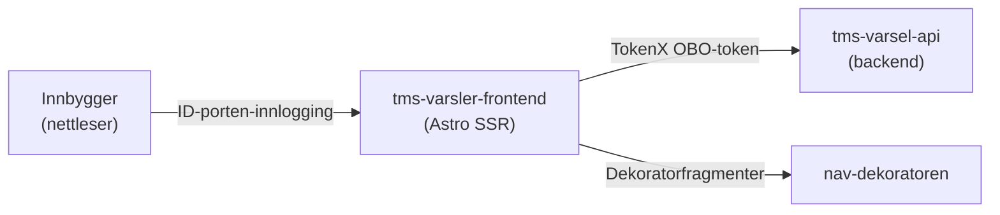

# tms-varsler-frontend

Frontend for varsler til innloggede brukere på Min side. Brukerne kan se nye oppgaver og beskjeder, finne varsler fra det siste året og filtrere tidligere varsler etter type eller innhold. Løsningen støtter bokmål, nynorsk og engelsk.

Appen krever innlogging med ID-porten. Varsler som krever høyere sikkerhetsnivå, vises etter ny innlogging på nivå 4.

## Arkitektur

Innkommende forespørsler autentiseres i Astro-middleware med `@navikt/astro-auth`. Frontenden veksler brukerens token til et on-behalf-of-token via TokenX før den henter varsler fra `tms-varsel-api`.

## Miljøer

- [Produksjon](https://www.nav.no/minside/varsler)
- [Utvikling](https://www.ansatt.dev.nav.no/minside/varsler)

## Backend

### [tms-varsel-api](https://github.com/navikt/tms-varsel-api)

Leverer aktive og tidligere varsler. Frontenden henter data med et TokenX on-behalf-of-token og kan inaktivere beskjeder når brukeren følger lenken i et varsel.

- **GET** `/tms-varsel-api/alle`
- **POST** `/tms-varsel-api/beskjed/inaktiver`

## Utvikling

Appen kjører lokalt på [http://localhost:4321/minside/varsler](http://localhost:4321/minside/varsler). Det lokale utviklingsmiljøet bruker mockdata gjennom Astro-integrasjonen `@navikt/astro-mocks`.

Kjør `pnpm run` for en oppdatert oversikt over tilgjengelige kommandoer for lokal kjøring, bygging, linting og tester. Repoet bruker Vitest til enhets- og komponenttester og Playwright til ende-til-ende-tester og automatiserte tilgjengelighetssjekker.

## Henvendelser

Spørsmål om koden eller prosjektet kan opprettes som [issues i GitHub](https://github.com/navikt/tms-varsler-frontend/issues).

## For Nav-ansatte

Interne henvendelser kan sendes i Slack-kanalen [#minside-varsler](https://nav-it.slack.com/archives/CR61BPH7G).
